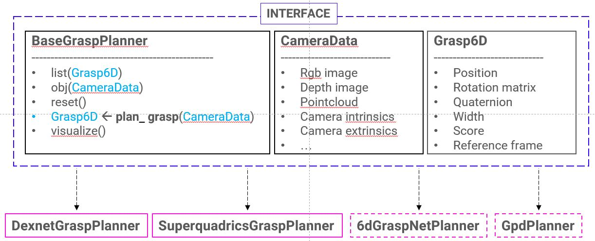
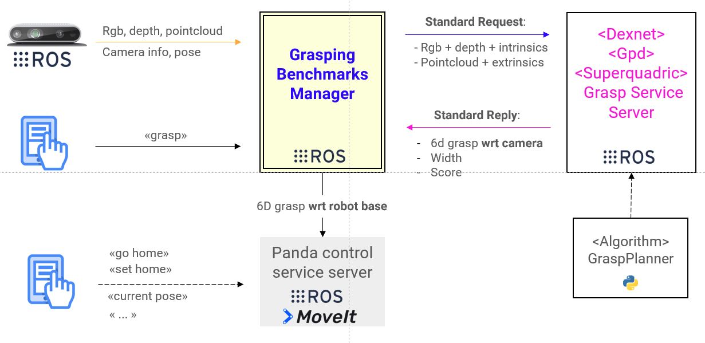

# benchmark-grasping

This repository contains a framework to benchmark different robotic grasp planning algorithms with a robotic manipulator under a common interface. It is designed to work with both a simulated and a real robot.

It is composed of 3 main modules:
- [benchmark_grasping](./benchmark_grasping): a python package that provides the base interface for the grasp planners and a class for each supported algorithm.
- [benchmark_grasping_ros](./benchmark_grasping_ros): a ROS-based framework that allows to benchmark the grasp planners on the robotic platform.
- [docker](./docker): a collection of docker images, one for each supported grasp planner, that include the algorithm software and its dependencies and the benchmark_grasping_ros.

The wrapped grasp planners available so far are:
- **Dexnet**: [documentation](https://berkeleyautomation.github.io/dex-net/), [paper](https://arxiv.org/pdf/1703.09312.pdf)
- **GPD**: [documentation](https://github.com/atenpas/gpd), [paper](https://arxiv.org/pdf/1706.09911.pdf)
- **Superquadrics-based grasp planner**:  [documentation](https://github.com/robotology/superquadric-lib), [paper](http://lornat75.github.io/papers/2017/vezzani-icra.pdf)

## Overview
- [Installation](#installation)
    - [benchmark grasping](#benchmark-grasping)
    - [benchmark grasping ros](#benchmark-grasping-ros)
    - [docker](#docker)
- [Benchmark Grasping Description](#benchmark-grasping-description)
- [Benchmark Brasping Ros Description](#benchmark-grasping-ros-description)
     - [How to Run](#how-to-run)
---

## Installation
The installation have to be done with **Python3**.
### benchmark grasping
Follow these instruction if you want to install only the python package without the ROS framework.

1. Clone the repository:
    ```bash
    $ git clone https://github.com/eleramp/benchmark-grasping.git

    ```

2. Install the package in editable mode:
    ```bash
    $ cd benchmark-grasping
    $ pip3 install -e .
    ```

3. Test the installation with:
    ```Python3
    import benchmark_grasping
    help(benchmark_grasping)
    ```

### benchmark grasping ros
Follow these instructions if you want to install also the ROS framework. To install and use this module, you need to include it in a *catkin workspace*.

1. Install python3 ROS packages:
    ```bashrc
    $ sudo apt update
    $ sudo apt install python3-catkin-pkg-modules python3-rospkg-modules python3-empy
    ```

2. Create a catkin workspace:
    ```bash
    $ mkdir -p ~/catkin_ws/src
    $ cd catkin_ws
    $ wstool init
    ```

3. Add to the catkin workspace some ROS dependencies to be built with python3:
    ```bash
    $ wstool set -y src/geometry2 --git https://github.com/ros/geometry2 -v 0.6.5
    $ wstool set -y src/vision_opencv --git https://github.com/ros-perception/vision_opencv -v 1.13.0
    $ wstool set -y src/ros_numpy https://github.com/eric-wieser/ros_numpy
    $ wstool up
    ```

4. Clone the repository:
    ```bash
    $ wstool set -y src/benchmark-grasping --git https://github.com/eleramp/benchmark-grasping
    $ wstool up
    ```

5. Install the package in editable mode:
    ```bash
    $ cd src/benchmark-grasping
    $ pip3 install -e .
    ```

6. Install the dependencies of the algorithm you want to benchmark. You can follow the instructions provided by the authors of each algorithm. The currently supported algorithms are:
    - **Dexnet**:You need to install [gqcnn](https://berkeleyautomation.github.io/gqcnn/)
    - **GPD**: Follow [gpd](https://github.com/atenpas/gpd)
    - **Superquadrics-based grasp planner**: Follow [superquadric-lib](https://github.com/robotology/superquadric-lib). Note that you need to compile the python bindings.

7. Build the catkin workspace:
    ```bash
    $ cd ~/catkin_ws
    # Set -DGPD_ROS=ON if you want to benchmark GPD
    $ catkin config --extend /opt/ros/melodic -DPYTHON_EXECUTABLE=/usr/bin/python3 -DCMAKE_BUILD_TYPE=Release -DGPD_ROS=OFF
    $ catkin build
    $ source devel/setup.bash
    $ echo 'source ~/catkin_ws/devel/setup.bash' >> ~/.bashrc
    ```

### docker
You can build the docker image for the specific algorithm you want to use by doing:
1. Clone the repository:
    ```bash
    $ git clone https://github.com/robotology/benchmark-grasping.git
    $ cd benchmark-grasping/docker
    ```

2. Install the package in editable mode:
    ```bash
    $ cd build_images
    $ make USER_NAME=<docker_image_user_name> <target>
    ```
    | targets |
    | ------- |
    | dexnet |
    | gpd |
    | superquadrics |
    | 6dgraspnet |

3. [Optional] There are also two additional docker images that can be built, one with development tools such as qtcreator and atom ([tools/](./docker/tools)) and another one with the Franka Panda libraries such as franka-ros and moveit ([panda_deps/](./docker/panda_deps)).
These images are intended to provide additional features to the images compiled at point 2.

    To create a unique image, you can use *docker-compose*. An example script is provided in [/docker/build_images/docker-compose.yaml](./docker/build_images/docker-compose.yaml).

## Benchmark Grasping Description
The grasping benchmark python package follows the structure shown in the figure below.

<p align="center">
  
</p>

The code of the interface is inside the folder [base/](./base). It provides:
- **BaseGraspPlanner**: the base image that should be inherited by the `<algorithm>GraspPlanner` classes. The principal feature of this class is the `plan_grasp()` method, which takes as input an object of type `CameraData` and returns the grasp pose as an object of type `Grasp6D`.
- **CameraData**: a class that needs to be filled with the camera data necessary to compute a grasp candidate.
- **Grasp6D**: a class that contains the info of the grasp candidate computed by the algorithm.
- **Transformations**: it is provided also a bunch of functions to compute rotation transformations.

Each algorithm that inherits from the *BaseGraspPlanner* interface needs to:
- fill the `plan_grasp()` method with the code to compute the grasp poses
- provide a `create_camera_data()` method that fills the `CameraData` object in the proper format required by the specific algorithm.
- fill the `visualize()` method with the code to visualize the grasp purposes
- eventually extend the `reset()` method

The python package can be imported in any python code as:
```bashrc
import benchmark_grasping
```

## Benchmark Grasping Ros Description
The grasping benchmark ros framework follows the structure shown in the figure below.

<p align="center">
  
</p>

#### **Benchmark Grasping Manager**
It is the main actor of the framework, connecting the different modules and sending data to the robot control module.

1. It reads the data sent by a Realsense camera through the ros module [IntelRealSense/realsense-ros](https://github.com/IntelRealSense/realsense-ros.git). The subscribed topics are:
  - `/camera/color/image_raw`: rgb image
  - `/camera/aligned_depth_to_color/image_raw`: aligned depth
  - `/camera/depth_registered/points`: point cloud

  It also reads the camera pose wrt the robot base that should be part of the TF ROS tree. This pose can be publish on ros tof with the following command:
      ```bash
      $ rosrun tf static_transform_publisher 0.047 -0.03496 -0.08288 0.008 -1.506 3.14 /robot_EE /camera_link 50
      ```

2. It receives also a few commands from a user through a `user_cmd_service`. Available commands are:
  - `help`: list of available commands
  - `grasp`: computes a new grasp
  - `abort`: abort the grasp computation/execution in case a bad grasp pose is computed

3. It connects with the algorithm service server. It sends the camera data and receives the candidate grasp.

    The service type implemented by the algorithm service server should chosen among the standard services provided, depending on the type of data required by the grasp planning algorithm:
    - [GraspPlanner.srv](./benchmark_grasping_ros/srv/GraspPlanner.srv)
    - [GraspPlannerCloud.srv](./benchmark_grasping_ros/srv/GraspPlannerCloud.srv)

    Each service returns a [msg/BenchmarkGrasp.msg](./benchmark_grasping_ros/msg/BenchmarkGrasp.msg).

4. Finally it connects with the Robot Control service server. It sends the grasp pose as a `geometry_msgs/PoseStamped` message, through the service [robot_grasp_srv](./robot_grasp_srv). The Robot Control service server executes the grasp and return the failure/succes of the grasp.

### How to Run

1. Run your service to control the robot. 

    Note: The ros services sent by the [benchmark ros manager](./benchmark_grasping_ros/benchmark_ros_manager.py) are of type [robot_grasp_srv](./robot_grasp_srv)

2. Run the benchmarks framework. 
    - You may need to set the correct paths to the models/config files in [benchmark_grasping_ros/launch/grasp_planning_benchmark.launch](./benchmark_grasping_ros/launch/grasp_planning_benchmark.launch)

    - Execute the launch file by specifying the name of the algorithm to benchmark:
      ```bashrc
      $ roslaunch benchmark_grasping_ros grasp_planning_benchmark.launch realsense:=true <target>:=true
      ```

      | targets |
      | ------- |
      | dexnet |
      | gpd |
      | superquadrics |

    - Send grasp commands to the service `/<target>_bench/user_cmd`. For example:
      ```bashrc
      $ rosservice call /dexnet_bench/user_cmd "cmd: data: 'grasp'"
      ```
